# Apify demo - PyCon Vilnius 2025

This is a demo Actor used during the [workshop](https://pycon.lt/talks/LAG8AJ) in Vilnius in 2025. It showcases how to implement and monetize a simple Apify Actor using the BeautifulSoup and Crawlee template from Apify. The Actor scrapes the names of speakers at the conference, along with the titles of their talks. The intended use case is to quickly create a database of speakers to potentially connect with them in the future.

## 1. Create an Apify account
Head to [Apify Console](https://console.apify.com/sign-up) and create an account, or login with Google or Github.

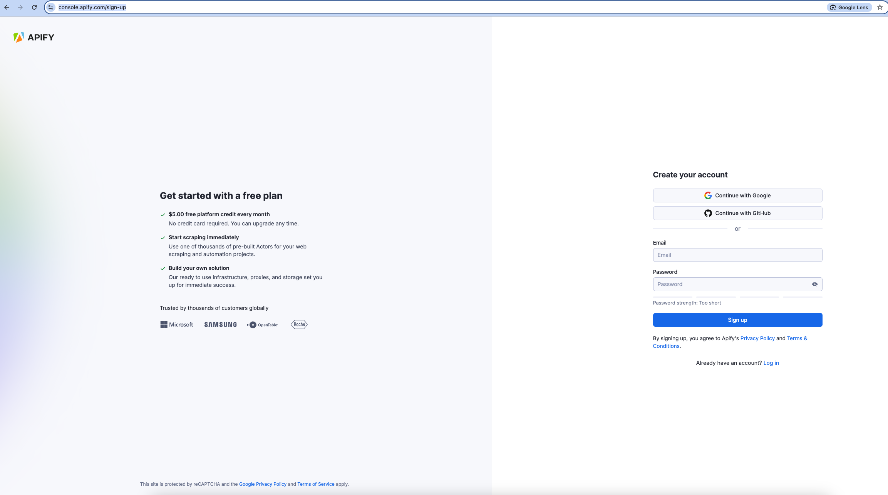

## 2. Create a new Actor using template
Head to [Actors > Development](https://console.apify.com/actors/development/my-actors) and click "Develop new."


Click on "View all templates," find "Crawlee + BeautifulSoup" template, and install it.

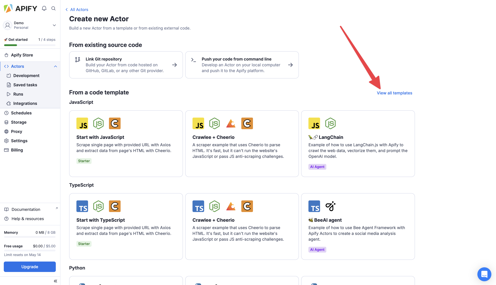

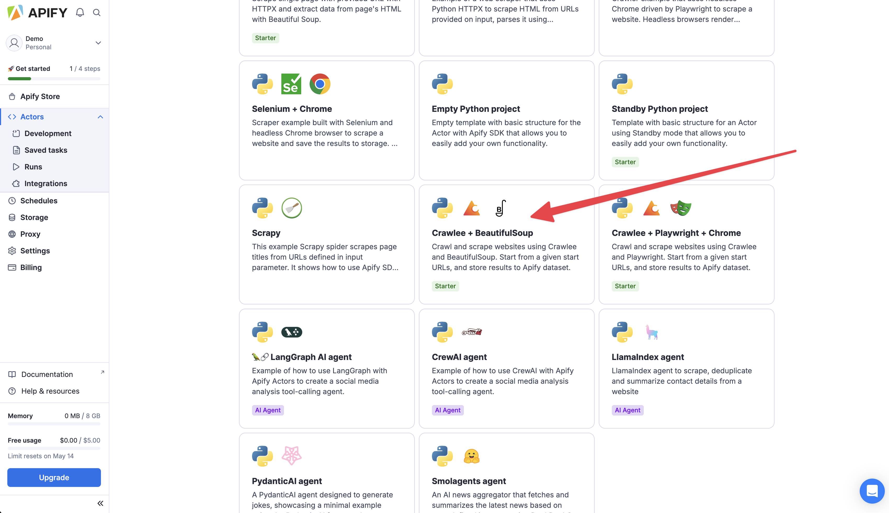

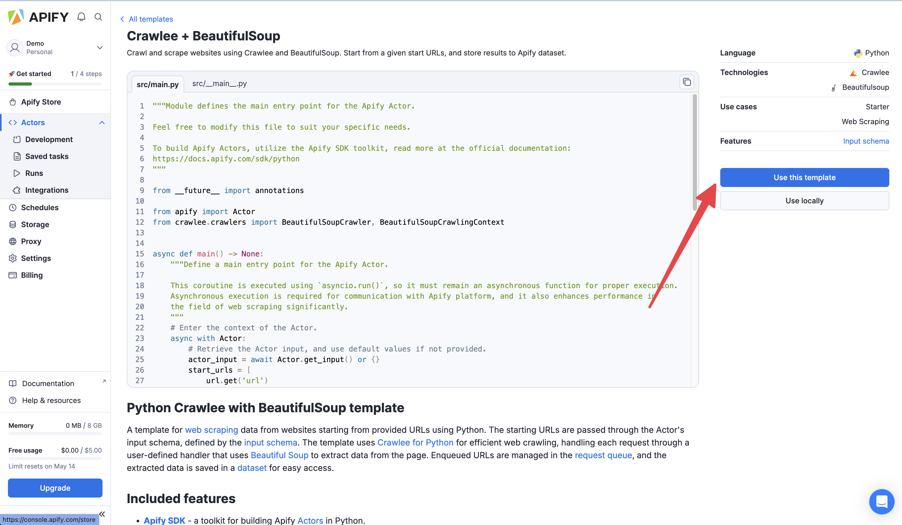

## 3. Inspecting the target website
Go to [pycon.lt](https://pycon.lt/) and inspect the pages dedicated for the three days of the conference ([Python day](https://pycon.lt/day/python), [Data day](https://pycon.lt/day/data), [AI day](https://pycon.lt/day/ai)).

Let's take Python day for example. Open developer tools in your browser and inspect the HTML structure of the page.

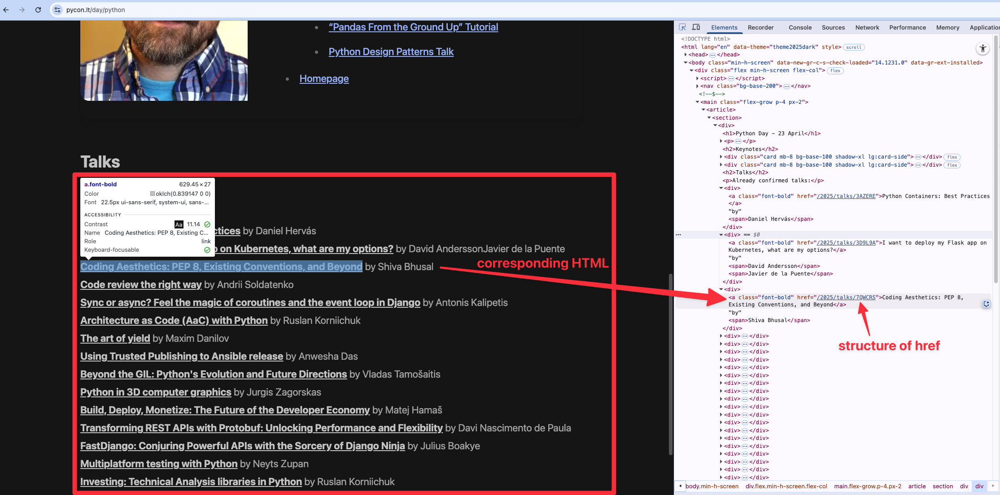

Bingo, it seems that all we need to do is to fetch all `<a href="...">` links where "href" is a string that starts with "/2025/talks." Then, we can get the text in that href (talk title), and find the closest "<span>" afterwards, which contains the speaker name. Let's get to coding.

## 4. Coding
### 4.1 Modifying the input schema
Let's head to ".actor/input_schema.json" and modify the "prefill" for the "start_urls" to "https://pycon.lt/day/python." While on it, let's also change the "title" of the schema to something more reasonable.

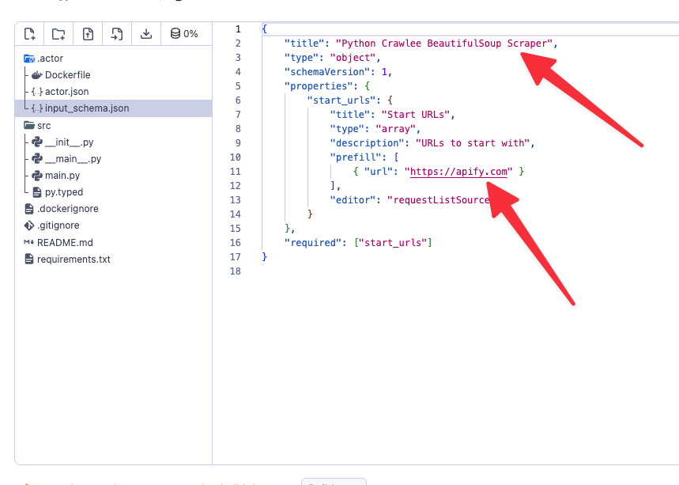

### 4.2 Modifying Actor.json
In ".actor/actor.json", let's just quickly change the "name", "title" and "description" to something more sensible.

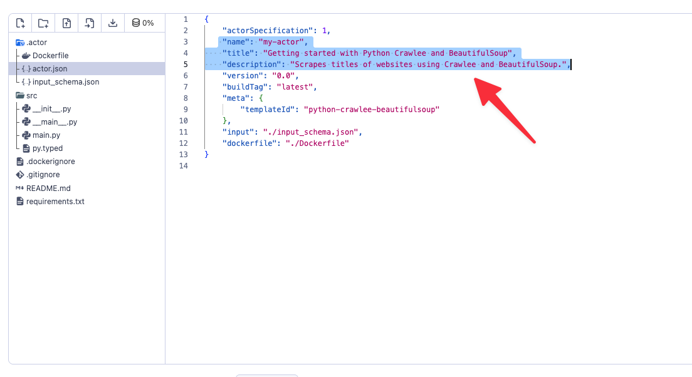

### 4.3 Strapping code of fluff
Head to "main.py" and remove all unnecessary comments and other things. While on it, feel free to remove the default input URL fallback, as the input is required and will be always present. You can also remove "max_requests_per_crawl=50," as we won't be using it. Finally, in "request_handler" remove everything apart from printing the "context.request.url".

```python
from __future__ import annotations

from apify import Actor
from crawlee.crawlers import BeautifulSoupCrawler, BeautifulSoupCrawlingContext


async def main() -> None:
    async with Actor:
        actor_input = await Actor.get_input() or {}
        start_urls = [
            url.get('url')
            for url in actor_input.get('start_urls', [])
        ]

        if not start_urls:
            Actor.log.info('No start URLs specified in Actor input, exiting...')
            await Actor.exit()

        crawler = BeautifulSoupCrawler()

        @crawler.router.default_handler
        async def request_handler(context: BeautifulSoupCrawlingContext) -> None:
            url = context.request.url
            Actor.log.info(f'Scraping {url}...')

        await crawler.run(start_urls)
```

Now you are ready to try out your Actor!

### 4.4 Trying out the very simple version
Before running the Actor, you need to build it, to create an image that will later be executed upon runtime. Once, you Actor is built, start it. Check the "Input" tab before, to make sure you have correctly pre-populated input with the Python day URL. This is prefilled from the "prefill" property you added in "input_schema.json".

Your current implementation is executing "request_handler" for each "start_url" (by default single one for the Python day). Then, it's simply printing the URL to the log. You might see the log duplicated, as one is appended with extra system message.

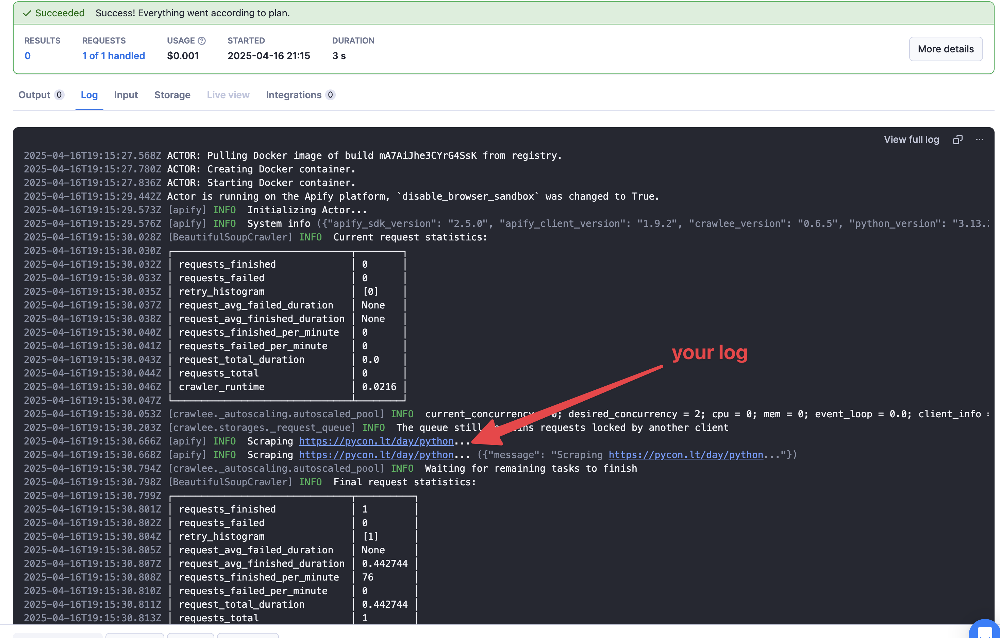

### 4.5 Extracting speakers and their talk titles
In this part, let's modify the "request_handler" function to actually extract the the speaker name and talk title from the page, into "speaker_name" and "talk_title" variables. Let's also parse out which "day" this is from the url (python day in our example). Feel free to use BeautifulSoup docs, Google, or any LLM tool you fancy.

Add the end of the handler, add following snippet to push each datapoint into the dataset (kind of a table associated with the run). 
```python
await Actor.push_data({
    'speaker_name': speaker_name,
    'talk_title': talk_title,
    'day': day
})
```

For completness, the code is
```python
@crawler.router.default_handler
async def request_handler(context: BeautifulSoupCrawlingContext) -> None:
    url = context.request.url
    day = url.split('/')[-1]
    Actor.log.info(f'Scraping {url}...')
    soup = context.soup
    talk_links = soup.find_all('a', href=lambda x: x and x.startswith('/2025/talks'))

    for link in talk_links:
        talk_title = link.text.strip()
        speaker_name = None

        parent_div = link.find_parent('div')
        if parent_div:
            speaker_spans = parent_div.find_all('span')
            if speaker_spans:
                speaker_span = speaker_spans[-1]
                speaker_name = speaker_span.text.strip()

        Actor.log.info(f'Speaker: {speaker_name}, Talk: {talk_title}, Day: {day}')

        await Actor.push_data({
            'speaker_name': speaker_name,
            'talk_title': talk_title,
            'day': day,
        })
```

Let's rebuild and restart the Actor in the Console. When you head to the "Output tab", you should see table with the speakers for Python day!

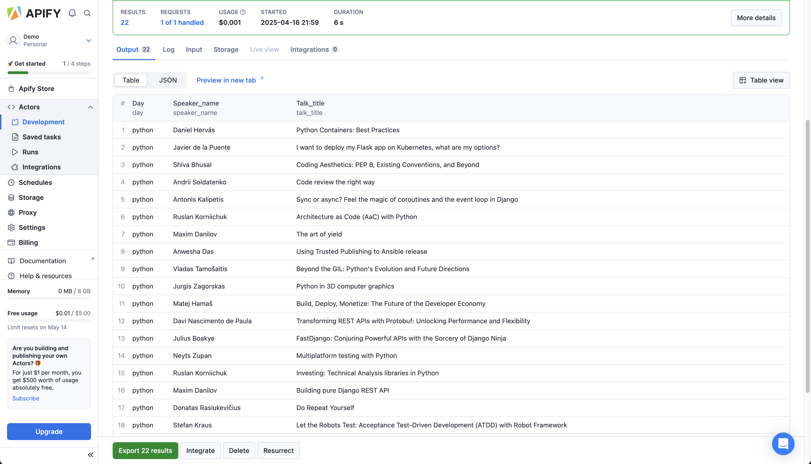

### 4.5 Trying out for all 3 days
Head to "Input" section of your Actor, and add also URLs for Data day (https://pycon.lt/day/data) and AI day (https://pycon.lt/day/ai).

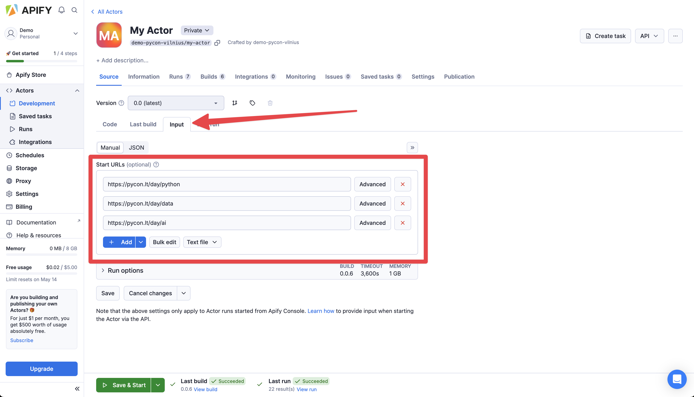

When you run the Actor, head to the "Output" tab. You might see that the speakers for the Data day are missing.

> Exercise: figure out why and change the code to include them as well.

**Solution**

For some reason, "<a href='...'>"on Data day page have "href" links that don't start with "'/2025/talks'", but only "/talks".


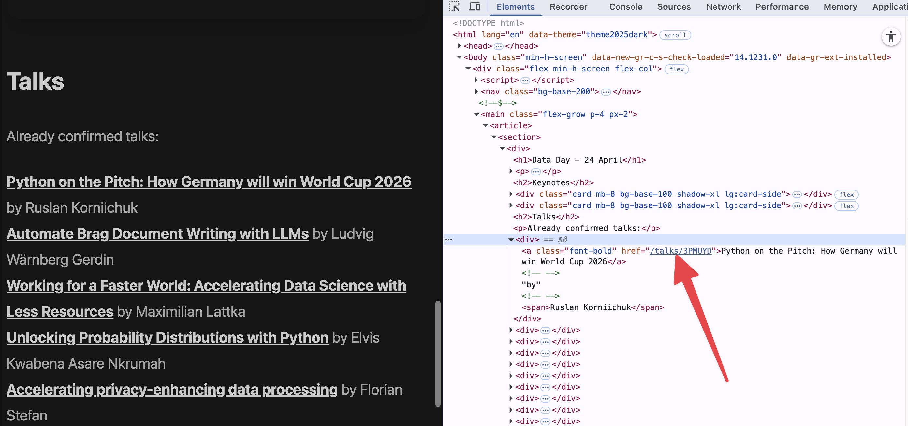

We need to modify the "startswith()" condition to handle both cases. Let's update the relevant line to
```python
talk_links = soup.find_all(
    'a',
    href=lambda x: x and (x.startswith('/2025/talks') or x.startswith('/talks/'))
)
```

### 4.6 Add monetization
Add "await Actor.charge('speaker')" just before you push to the dataset.

Then, head to "Publication > Monetization" section to set up the monetization. You will need to first fill in your contact details for payouts. Feel free to put some mock data there for the sake of trying it out, you can always change it later.

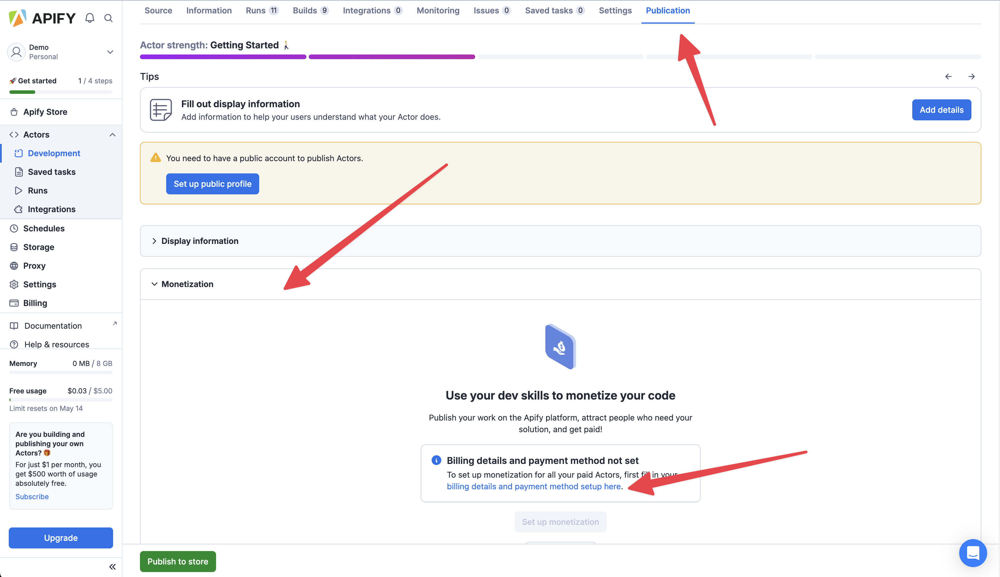

When you've added your details, click "Set up monetization" and chose "Pay per event" model. That's the pricing model that allows you to charge via "Actor.charge" directly from the code.

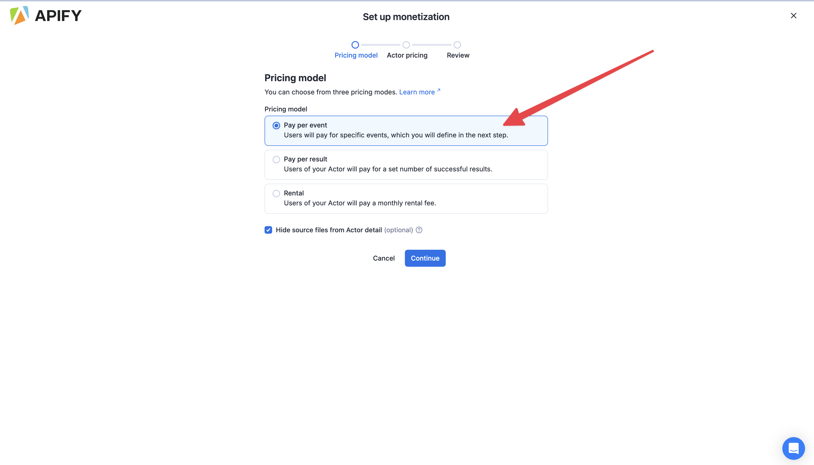

Finally, you need to set up your events you can charge for using "Actor.charge". Previously, we added "Actor.charge('speaker')" to the code, so let's add single "spaker" event with some nice title and description.

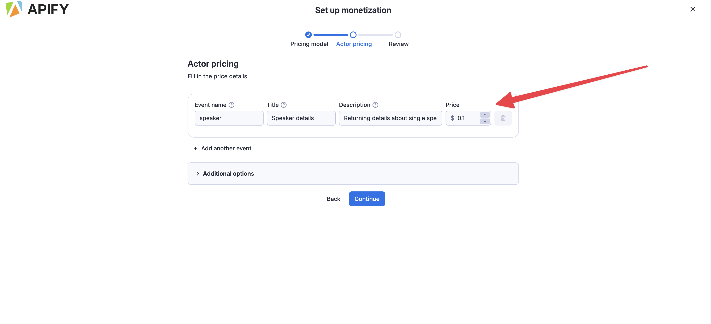

And that's it, now your code is monetized and after publishing, you would start earning money on every paying user that runs it.


## 5. Publishing your Actor
Publishing an Actor is a single button click "Publish to Store" in the "Publication" tab. Having said that, since the Actor has monetization attached model, we won't publish it now, because public monetized Actor can be only taken down with 14 day notice, as some users might be dependent on it. So let's keep it simple and skip this step.

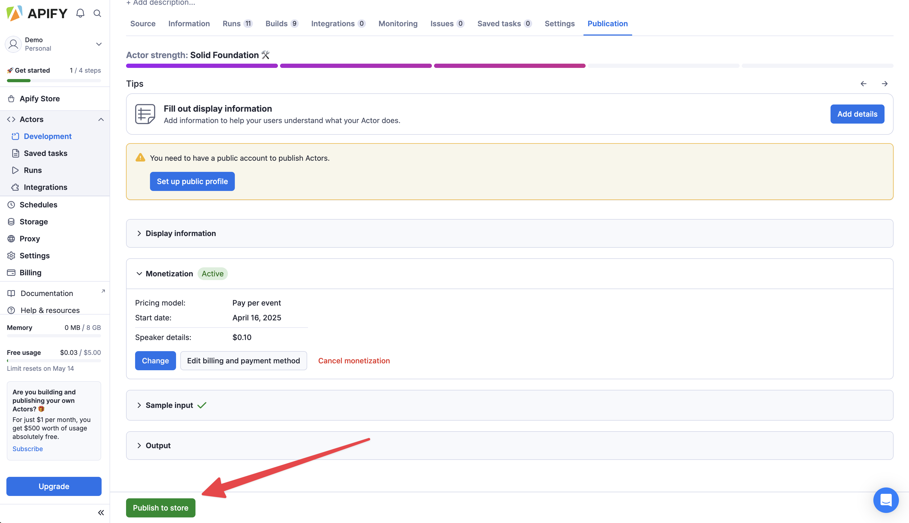

## 6. Bonus: getting LinkedIn URLs
In this bonus section, you will use the existing [Google Search Scraper](https://apify.com/apify/google-search-scraper) to try to find the LinkedIn URL for each speaker.

You can call this Actor from your code via "await Actor.call('apify/google-search-scraper')". Play with the Actor in the Console to discover correct input
parameters to use as the 2nd argument. Then, use the "default_dataset_id" from the call result to open dataset "await Actor.open_dataset" iterate results and extract the LinkedIn URL, if found. Store this URL to your output as well.

**Solution**
```python
linkedin_url = None
if speaker_name:
    call_result = await Actor.call('apify/google-search-scraper', {
        "forceExactMatch": False,
        "includeIcons": False,
        "includeUnfilteredResults": False,
        "maxPagesPerQuery": 1,
        "mobileResults": False,
        "queries": f'site:linkedin.com/in \"{speaker_name}\"',
        "resultsPerPage": 10,
        "saveHtml": False,
        "saveHtmlToKeyValueStore": False
    })
    if call_result:
        dataset = await Actor.open_dataset(id=call_result.default_dataset_id, force_cloud=True)
        async for page in dataset.iterate_items():
            for result in page['organicResults']:
                if not linkedin_url and 'linkedin.com/in' in result.get('url', ''):
                    linkedin_url = result.get('url')
```