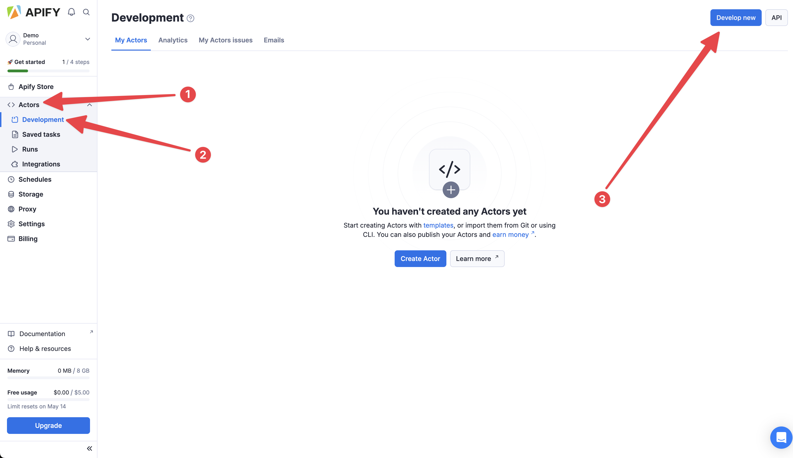

# Apify Demo - PyCon Vilnius 2025

This is a demo Actor used during the [workshop](https://pycon.lt/talks/LAG8AJ) in Vilnius in 2025. It showcases how to implement and monetize a simple Apify Actor using the Beautiful Soup and Crawlee template from Apify. The Actor scrapes the names of speakers at the conference, along with the titles of their talks. The intended use case is to quickly create a database of speakers for potentially connecting with them in the future.

## Step 1 - create Apify Account
Head to [Apify Console](https://console.apify.com/sign-up) and create an account, or login with Google / Github.


## Step 2 - create a new Actor using template
Head to [Actors > Development](https://console.apify.com/actors/development/my-actors) and cick `Develop new`.



Click on `View all templates`, find `Crawlee + BeautifulSoup` template, and install it.


## Step 3 - inspecting the target website
Go to [pycon.lt](https://pycon.lt/) and inspect the pages dedicated for the 3 days of the conference ([Python day](https://pycon.lt/day/python), [Data day](https://pycon.lt/day/data), [AI day](https://pycon.lt/day/ai)).

Let's take Python day for example. Open developer tools in your browser and inspect the HTML structure of the page.


Bingo, it seems that all we need to do is to fetch all `<a href="...">` links where `href` is a string that starts with `/2025/talks`. Then, we can get the text in that href (talk title), and find the closest `<span>` afterwards, which contains the speaker name. Let's get to coding.

## Step 4 - coding
### 4.1 Modifying the input schema
Let's head to `.actor/input_schema.json` and modify the `prefill` for the `start_urls` to `https://pycon.lt/day/python`. While on it, let's also change the `title` of the schema to something more reasonable.


### 4.2 Modifying actor.json
In `.actor/actor.json`, let's just quickly change the `name`, `title` and `description` to something more sensible.


### 4.3 Strapping code of fluff
Head to `main.py` and remove all unnecessary comments and other things. While on it, feel free to remove the default input URL fallback, as the input is required and will be always present. You can also remove `max_requests_per_crawl=50,` as we won't be using it. Finally, in `request_handler` remove everything apart from printing the `context.request.url`.

```python
from __future__ import annotations

from apify import Actor
from crawlee.crawlers import BeautifulSoupCrawler, BeautifulSoupCrawlingContext


async def main() -> None:
    async with Actor:
        actor_input = await Actor.get_input() or {}
        start_urls = [
            url.get('url')
            for url in actor_input.get('start_urls', [])
        ]

        if not start_urls:
            Actor.log.info('No start URLs specified in Actor input, exiting...')
            await Actor.exit()

        crawler = BeautifulSoupCrawler()

        @crawler.router.default_handler
        async def request_handler(context: BeautifulSoupCrawlingContext) -> None:
            url = context.request.url
            Actor.log.info(f'Scraping {url}...')

        await crawler.run(start_urls)
```

Now you are ready to try out your Actor!

### 4.4 Trying out the very simple version
Before running the Actor, you need to build it, to create an image that will later be executed upon runtime. Once, you Actor is built, start it. Check the `Input` tab before, to make sure you have correctly pre-populated input with they Python day URL. This is prefilled from the `prefill` property you added in `input_schema.json`.

Your current implementation is executing `request_handler` for each `start_url` (by default single one for the Python day). Then, it's simply printing the URL to the log. You might see the log duplicated, as one is appended with extra system message.


### 4.5 Extracting speakers and their talk titles
In this part, let's modify the `request_handler` function to actually extract the the speaker name and talk title from the page, into `spaker_name` and `talk_title` variables. Let's also parse out which `day` this is from the url (python day in our example). Feel free to use BeautifulSoup docs, Google, or any LLM tool you fancy.

Add the end of the handler, add following snippet to push each datapoint into the dataset (kind of a table associated with the run). 
```python
await Actor.push_data({
    'speaker_name': speaker_name,
    'talk_title': talk_title,
    'day': day
})
```

For completness, the code is
```python
@crawler.router.default_handler
async def request_handler(context: BeautifulSoupCrawlingContext) -> None:
    url = context.request.url
    day = url.split('/')[-1]
    Actor.log.info(f'Scraping {url}...')
    soup = context.soup
    talk_links = soup.find_all('a', href=lambda x: x and x.startswith('/2025/talks'))

    for link in talk_links:
        talk_title = link.text.strip()
        speaker_name = None

        parent_div = link.find_parent('div')
        if parent_div:
            speaker_spans = parent_div.find_all('span')
            if speaker_spans:
                speaker_span = speaker_spans[-1]
                speaker_name = speaker_span.text.strip()

        Actor.log.info(f'Speaker: {speaker_name}, Talk: {talk_title}, Day: {day}')

        await Actor.push_data({
            'speaker_name': speaker_name,
            'talk_title': talk_title,
            'day': day,
        })
```

Let's rebuild and restart the Actor in the Console. When you head to the `Output tab`, you should see table with the speakers for Python day!


